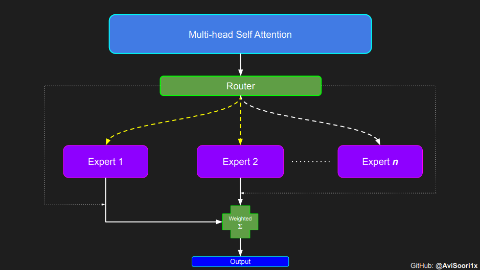
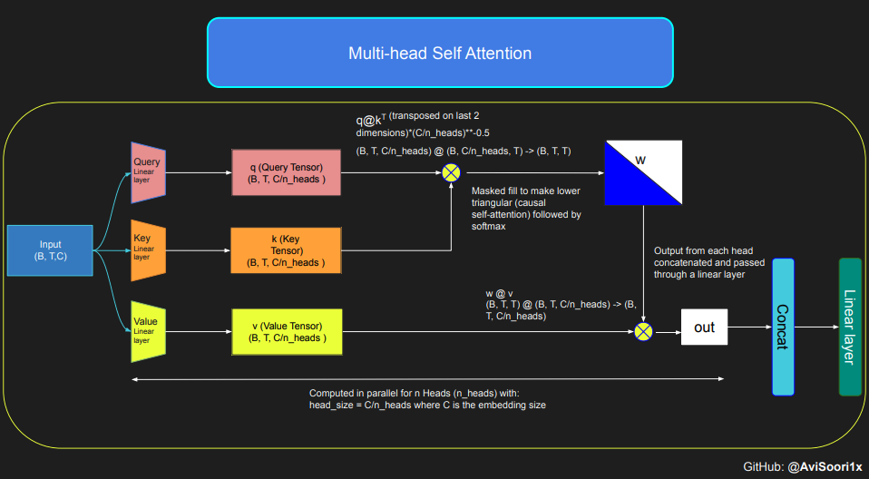
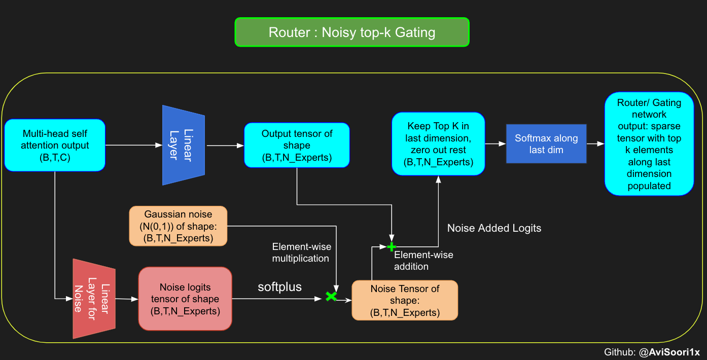
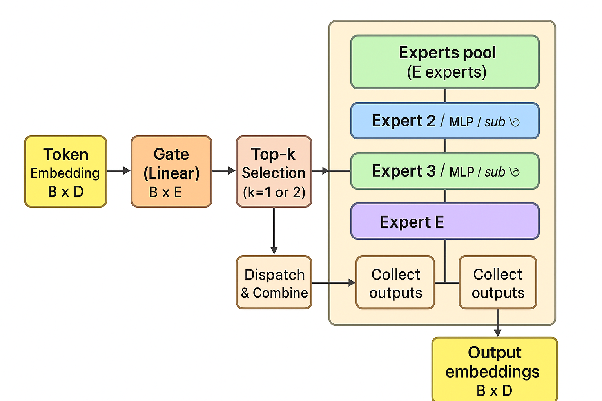

# Mixture of Experts (MoE) — Explained

**Source notebook summary (extracted key information):**

#### Sparse mixture of experts language model from scratch inspired by (and largely based on) Andrej Karpathy's makemore (https://github.com/karpathy/makemore) :)

This is a from scratch implementation of a sparse mixture of experts language model. This is inspired by and largely based on Andrej Karpathy's project 'makemore' and borrows most of the re-usable components from that implementation. Just like makemore, makeMoE is also an autoregressive character-level language model but uses the aforementioned sparse mixture of experts architecture.

Just like makemore, pytorch is the only requirement (so I hope the from scratch claim is justified).

Significant Changes from the makemore architecture

- Sparse mixture of experts instead of the solitary feed forward neural net.
- Top-k gating and noisy top-k gating implementations.
- initialization - Kaiming He initialization is used here but the point of this notebook is to be hackable so you can swap in Xavier Glorot etc. and take it for a spin.

Unchanged from makemore
- The dataset, preprocessing (tokenization), and the language modeling task Andrej chose originally - generate Shakespeare-like text
- Casusal self attention implementation
- Training loop
- Inference logic

Publications heavily referenced for this implementation:
- Mixtral of experts: https://arxiv.org/pdf/2401.04088.pdf
- Outrageosly Large Neural Networks: The Sparsely-Gated Mixture-Of-Experts layer: https://arxiv.org/pdf/1701.06538.pdf


This notebook walks through the intuition for the entire model architecture and how everything comes together

The code was entirely developed on Databricks using a single A100 for compute. If you're running this on Databricks, you can scale this on an arbitrarily large GPU cluster with no issues in the cloud provider of your choice

I chose to use mlflow (which comes pre-installed in Databricks. You can pip install easily elsewhere) as I find it helpful to track and log all the metrics necessary. This is entirely optional.

Please note that the implementation emphasizes readability and hackability vs performance, so there are many ways in which you could improve this. Please try and let me know




Next few sections, downloading the data, preprocessing it and self attention are directly from makemore. I have elaborated a little on self attention and added visual aids to understand the process a bit better.

The following code block clearly shows the autoregressive nature of the prediction and how the context is a rolling windows over a 1 dimentional arrangement of tokens (characters in this case)

### Understanding the intuition of Causal Scaled Dot Product Self Attention

This code is borrowed from Andrej Karpathy's excellent makemore repository linked in the repo



---

## Key information extracted from the notebook
- The notebook appears to implement a Mixture-of-Experts (MoE) model from scratch (title: `makeMoE_from_Scratch.ipynb`).
- It includes code experiments for gating functions, expert modules, routing of tokens to experts, and possibly load-balancing terms and top-k gating.
- The notebook contains code cells that train/validate a small MoE and visualization/diagnostic steps (check notebook for exact code examples).

---

## What is a Mixture of Experts (MoE)?
A Mixture of Experts is a neural network architecture that divides computation across multiple *experts* (sub-networks). A separate *gating* network (or function) dynamically routes each input (or token) to one or a few experts. Only the selected experts are evaluated for that input, making the model *sparse* in computation while enabling a very large total parameter count (many experts) without linear compute growth.

Key benefits:
- **Sparsity of compute**: each input touches only a subset of parameters.
- **Parameter efficiency**: can scale model capacity (#params) without scaling FLOPs proportionally.
- **Specialization**: experts can specialize on sub-regions of input space (e.g., different token types, tasks).

---

## How it works (step-by-step)

1. **Input features**: Suppose we have a batch of token embeddings X ∈ ℝ^(B×D) from a transformer layer.
2. **Gating network**: A small gating network (often a linear layer) produces scores for each expert: logits = X W_g ∈ ℝ^(B×E) where E is number of experts.
3. **Sparsification / Top-k**: For each input (row), pick top-k experts according to logits (commonly k=1 or 2). Convert logits to probabilities (softmax over selected experts) and set other expert weights to zero. This yields sparse routing.
4. **Dispatch**: For each chosen expert, send the corresponding inputs to the expert's sub-network. Experts compute their outputs (e.g., a small MLP).
5. **Combine**: Weighted sum the outputs from the experts according to gating probabilities to produce the final output for each input.
6. **Auxiliary losses**: Additional losses (load-balancing or importance losses) are often added to encourage balanced usage of experts so that some experts don't become overloaded while others stay idle.
7. **Backward pass**: Gradients flow through both experts and the gating network so that routing decisions and expert weights are jointly learned.

---

## Architecture (Mermaid diagram)


---

## Maths involved in MoE

Let:
- X ∈ ℝ^{B × D} be batch inputs (B tokens, D features).
- E be number of experts, each expert is a function f_e(·).
- Gate weights: W_g ∈ ℝ^{D × E}. Gate logits: G = X W_g ∈ ℝ^{B × E}.

**Top-1 gating (sparse routing)**:
- For each token i, choose expert e* = argmax_e G_{i,e}.
- Convert logits to softmax probabilities over the chosen experts (or use softmax over all experts then zero out non-top-k entries). Let p_{i,e} be probability that token i goes to expert e (mostly zero except for top-k).
- Expert outputs: y_{i} = Σ_{e=1}^E p_{i,e} f_e(x_i).

**Dispatch formulation (batched by expert)**:
Define a binary dispatch matrix D ∈ {0,1}^{B×E} where D_{i,e} = 1 if token i is routed to expert e (or fractional for probabilistic routing). For top-k with weights, D may be sparse real-valued with the gating weights.

Each expert processes only its assigned tokens: let S_e = {i | D_{i,e}>0}. Create a packed tensor X_e formed by stacking x_i for i in S_e. Expert e computes outputs F_e = f_e(X_e). These are then multiplied elementwise by the corresponding gate weights and scattered back to original indices.

**Load balancing / auxiliary loss** (from Shazeer et al. 2017 / "Outrageously Large Neural Networks"):

Define:
- Importance for expert e: I_e = Σ_{i=1}^B p_{i,e} (total gate probability mass assigned to expert e in a batch).
- Load for expert e: L_e = Σ_{i=1}^B I( expert e selected for i ) (count of tokens assigned).

Encourage uniform usage by minimizing the coefficient of variation of I_e (or L_e). One common loss:

    Loss_aux = E * Σ_{e=1}^E I_e^2

(Or more normally: Loss_aux = CV^2(I) or a term proportional to Σ_e I_e^2 scaled appropriately.)

Another implementation uses:

    LoadLoss = λ * E * (Σ_e p_e^2)

where p_e is normalized importance. This penalizes concentrated routing and encourages balanced assignment.

**Gradient flow note**: When using hard routing (non-differentiable argmax), a straight-through or approximation (softmax gating with top-k masking) is used so gradients flow through the gating logits. Many implementations use soft gating (softmax over logits) then zero out all but top-k entries, keeping the softmax gradients for the selected experts.

---

## Simple PyTorch MoE code snippet (single-file example)

This is a minimal example showing a Top-1 gated MoE layer in PyTorch. It focuses on clarity rather than performance or TPU-scale optimizations.

```python
import torch
import torch.nn as nn
import torch.nn.functional as F

class SimpleExpert(nn.Module):
    def __init__(self, d_model, d_hidden):
        super().__init__()
        self.fc1 = nn.Linear(d_model, d_hidden)
        self.fc2 = nn.Linear(d_hidden, d_model)
        self.act = nn.ReLU()

    def forward(self, x):
        return self.fc2(self.act(self.fc1(x)))

class Top1MoE(nn.Module):
    def __init__(self, d_model, d_hidden, n_experts):
        super().__init__()
        self.n_experts = n_experts
        self.experts = nn.ModuleList([SimpleExpert(d_model, d_hidden) for _ in range(n_experts)])
        self.gate = nn.Linear(d_model, n_experts)

    def forward(self, x):
        # x: [B, D]
        logits = self.gate(x)                # [B, E]
        probs = F.softmax(logits, dim=-1)    # [B, E]
        top1 = torch.argmax(probs, dim=-1)   # [B]
        
        # Prepare outputs placeholder
        outputs = x.new_zeros(x.size())      # [B, D]
        
        # Simple (inefficient) dispatch by looping experts
        for e in range(self.n_experts):
            mask = (top1 == e)
            if mask.sum() == 0:
                continue
            xe = x[mask]                    # tokens routed to expert e
            ye = self.experts[e](xe)       # [num_tokens_e, D]
            w = probs[mask, e].unsqueeze(-1)  # gating weights for these tokens
            outputs[mask] = ye * w         # weighted contribution
        
        return outputs, probs
```

**Notes on the snippet:**
- This uses Top-1 routing with softmax gating; gates are differentiable because `probs` come from softmax. We then route tokens to the argmax expert but still use the softmax probability as the output weight.
- This naive implementation loops over experts and uses boolean indexing, which is fine for small examples but slow for large-scale training. Production MoE implementations pack each expert's batch and run a batched expert forward for efficiency, reduce scatter/gather overhead, and implement capacity limits per expert.

---

## Practical considerations & tips
- **Capacity limits**: For each expert, limit the number of tokens it can accept per batch (capacity) to avoid out-of-memory spikes; spillover tokens can be assigned to next-best experts or dropped/held for the next step.
- **Batching by expert**: For speed, gather tokens assigned to each expert into a contiguous tensor and run a single forward pass per expert rather than many small forwards.
- **Expert specialization**: Use auxiliary losses to encourage balanced utilization; otherwise some experts may become dominant.
- **Scaling**: MoE layers are typically used sparsely between dense transformer layers to add parameter capacity without scaling FLOPs linearly.

---

## File saved
The full markdown above has been saved to /mnt/data/MoE_explained.md.

You can download it here:
[Download MoE_explained.md](sandbox:/mnt/data/MoE_explained.md)
