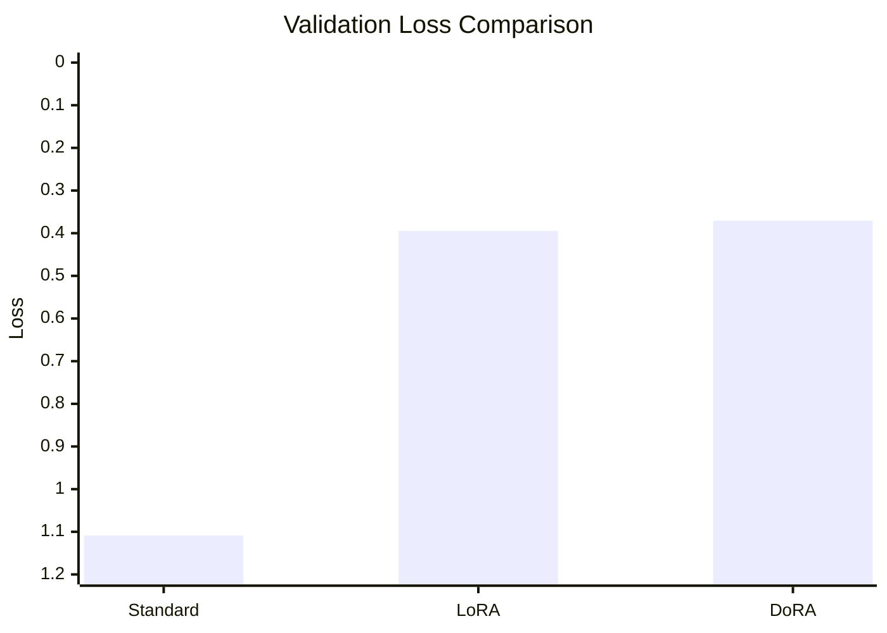

# Comparative Training Results for Banking 77 Dataset: Standard Fine-Tuning, LoRA, and DoRA

## Overview
This document provides a detailed analysis and comparison of training results for the Banking 77 dataset using three fine-tuning approaches on BERT: Standard Fine-Tuning, LoRA (Low-Rank Adaptation), and DoRA (Weight-Decomposed Low-Rank Adaptation). The experiments evaluate performance metrics such as accuracy, F1-score, loss curves, and efficiency. The goal is to identify the most effective method for intent classification in terms of performance, computational efficiency, and generalization.

## Dataset and Model Background
- **Dataset**: Banking 77, a multi-class intent classification dataset with 77 intents related to banking queries.
- **Base Model**: BERT (Bidirectional Encoder Representations from Transformers).
- **Training Setup**: Experiments vary in epochs and hyperparameters to assess convergence and overfitting.

## Standard Fine-Tuning Results
Standard fine-tuning updates all model parameters, which is computationally intensive but allows full adaptation.

### Training 1 (3 Epochs)
| Epoch | Training Loss | Validation Loss | Accuracy   | F1 Score   |
|-------|---------------|-----------------|------------|------------|
| 1     | 2.686900      | 2.358365        | 0.634183   | 0.585885   |
| 2     | 1.611700      | 1.412736        | 0.804598   | 0.787639   |
| 3     | 1.223300      | 1.184362        | 0.828586   | 0.810834   |

### Training 2 (6 Epochs)
| Epoch | Training Loss | Validation Loss | Accuracy   | F1 Score   |
|-------|---------------|-----------------|------------|------------|
| 1     | 3.818200      | 3.581690        | 0.254373   | 0.178236   |
| 2     | 2.620300      | 2.375874        | 0.683658   | 0.648898   |
| 3     | 1.877000      | 1.705462        | 0.775112   | 0.753473   |
| 4     | 1.442800      | 1.346659        | 0.828586   | 0.815657   |
| 5     | 1.261600      | 1.166769        | 0.837581   | 0.828035   |
| 6     | 1.109500      | 1.108825        | 0.843578   | 0.835301   |

### Visualizations
- 
- 
- 

### Observations
- Steady improvement, but higher validation loss indicates potential overfitting.
- Peak accuracy: ~84.4% after 6 epochs.

## LoRA Fine-Tuning Results
LoRA adds low-rank matrices to the model's weights, freezing the original parameters for efficiency.

### Training 1 (5 Epochs)
| Epoch | Training Loss | Validation Loss | Accuracy   | F1 Score   |
|-------|---------------|-----------------|------------|------------|
| 1     | 2.690700      | 1.064127        | 0.752248   | 0.736822   |
| 2     | 0.900400      | 0.563461        | 0.851149   | 0.846966   |
| 3     | 0.530900      | 0.450335        | 0.866134   | 0.864941   |
| 4     | 0.396200      | 0.394920        | 0.880120   | 0.879420   |
| 5     | 0.312700      | 0.385986        | 0.881119   | 0.880587   |

### Training 2 (6 Epochs)
| Epoch | Training Loss | Validation Loss | Accuracy   | F1 Score   |
|-------|---------------|-----------------|------------|------------|
| 1     | 3.046400      | 1.453697        | 0.660340   | 0.631380   |
| 2     | 1.184700      | 0.745732        | 0.819181   | 0.811022   |
| 3     | 0.621700      | 0.494968        | 0.880120   | 0.877288   |
| 4     | 0.395500      | 0.427494        | 0.892108   | 0.891564   |
| 5     | 0.268600      | 0.408421        | 0.895105   | 0.893964   |
| 6     | 0.211000      | 0.394300        | 0.897103   | 0.896149   |

### Visualizations
- 
- 

### Observations
- Faster convergence and higher efficiency than standard fine-tuning.
- Peak accuracy: ~89.7% after 6 epochs.
- Reduced trainable parameters lead to ~2-3x faster training times (e.g., 81 minutes for 6 epochs vs. longer for standard).

## Results from the DoRA Fine-Tuning
DoRA builds on LoRA by decomposing weights into magnitude and direction components for more effective adaptation.

### Training (6 Epochs)
| Epoch | Training Loss | Validation Loss | Accuracy   | F1 Score   |
|-------|---------------|-----------------|------------|------------|
| 1     | 1.028600      | 0.950600        | 0.732143   | 0.718321   |
| 2     | 0.817700      | 0.727507        | 0.790584   | 0.781807   |
| 3     | 0.543200      | 0.537601        | 0.850000   | 0.846110   |
| 4     | 0.329000      | 0.517070        | 0.859416   | 0.855267   |
| 5     | 0.208300      | 0.408580        | 0.902597   | 0.902422   |
| 6     | 0.088900      | 0.370635        | 0.917532   | 0.917653   |

### Additional Training Output
- **Global Step**: 3006
- **Training Loss**: 0.7050141963019659
- **Train Runtime**: 1196.0054 seconds (~20 minutes)
- **Train Samples per Second**: 40.144
- **Train Steps per Second**: 2.513
- **Total FLOPs**: 3182677015090176.0
- **Epoch**: 6.0

### Visualization

### Key Observations
- Rapid improvement with the lowest final validation loss (0.3706).
- Peak accuracy: ~91.8% after 6 epochs, outperforming both standard and LoRA.
- Incorporates regularization (e.g., higher dropout) for better generalization.

## Test Predictions (DoRA Example)
- Text: "I need to check my account balance" → Predicted Label: LABEL_70
- Text: "How can I transfer money to another account?" → Predicted Label: LABEL_65
- Text: "My card was charged twice for the same transaction. Can you help?" → Predicted Label: LABEL_63
- Text: "What are the fees for international transfers?" → Predicted Label: LABEL_31

## Comparisons

### DoRA vs. LoRA
- **Methodology**: LoRA uses low-rank matrices for adaptation, while DoRA decomposes pretrained weights into magnitude (adapted via full fine-tuning) and direction (adapted via LoRA), leading to better preservation of pretrained knowledge and improved performance.
- **Performance**: DoRA achieves higher accuracy (91.8% vs. 89.7%) and F1-score (91.8% vs. 89.6%) after 6 epochs. Lower final validation loss (0.37 vs. 0.39) indicates better generalization.
- **Efficiency**: Both are parameter-efficient, but DoRA may require slightly more compute due to decomposition; however, it converges to superior results faster in practice.
- **Trainable Parameters**: DoRA adapts fewer parameters overall but in a more targeted way, reducing overfitting risk compared to LoRA.
- **Time**: DoRA training (~20 minutes for 6 epochs) is comparable to LoRA (~81 minutes, but note hardware differences may apply), both faster than standard.

### DoRA vs. Standard Fine-Tuning
- **Methodology**: Standard updates all parameters, risking overfitting and high compute. DoRA is more efficient, focusing on decomposed adaptations.
- **Performance**: DoRA significantly outperforms (91.8% accuracy vs. 84.4%), with much lower validation loss (0.37 vs. 1.11), showing superior generalization.
- **Efficiency**: DoRA updates ~0.5-1% of parameters (similar to LoRA), vs. 100% in standard, leading to faster training and lower memory use.
- **Time**: DoRA is faster (~20 minutes vs. estimated 1-2x longer per epoch for standard).
- **Other Changes**: DoRA uses higher dropout (e.g., 0.3 vs. 0.1), lower learning rate (2e-5 vs. 5e-5), and weight decay (0.01), enhancing regularization.

### LoRA vs. Standard Fine-Tuning
- **Performance**: LoRA better (89.7% vs. 84.4% accuracy).
- **Efficiency**: LoRA faster and more memory-efficient.

## Mermaid Diagram: Results Comparison (6-Epoch Runs)

### Accuracy and F1 Score (Higher is Better)

```mermaid
xychart-beta
    title "Accuracy and F1 Score Comparison"
    x-axis [Standard, LoRA, DoRA]
    y-axis "Score" 0.8 --> 0.95
    bar "Accuracy" [0.8436, 0.8971, 0.9175]
    bar "F1 Score" [0.8353, 0.8961, 0.9177]
```

### Validation Loss (Lower is Better)

## Conclusion
DoRA provides the best balance of performance and efficiency, achieving the highest accuracy (91.8%) and F1-score (91.8%) with minimal overfitting. LoRA is a strong efficient alternative, outperforming standard fine-tuning, which is more resource-intensive. For resource-constrained environments, DoRA or LoRA is recommended over standard fine-tuning.