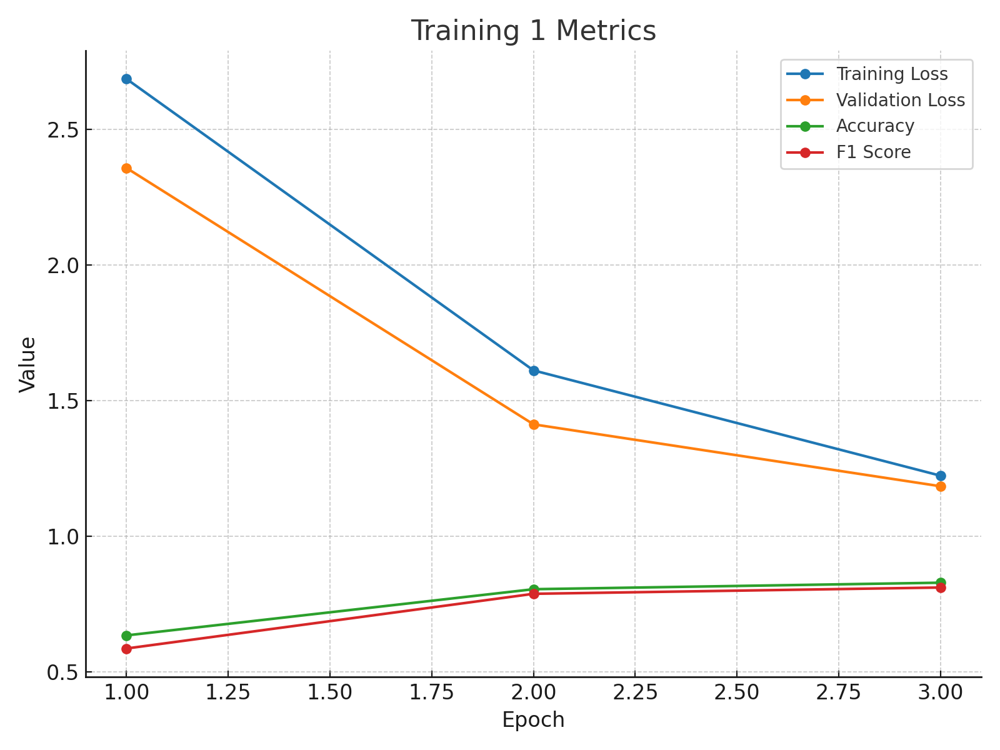
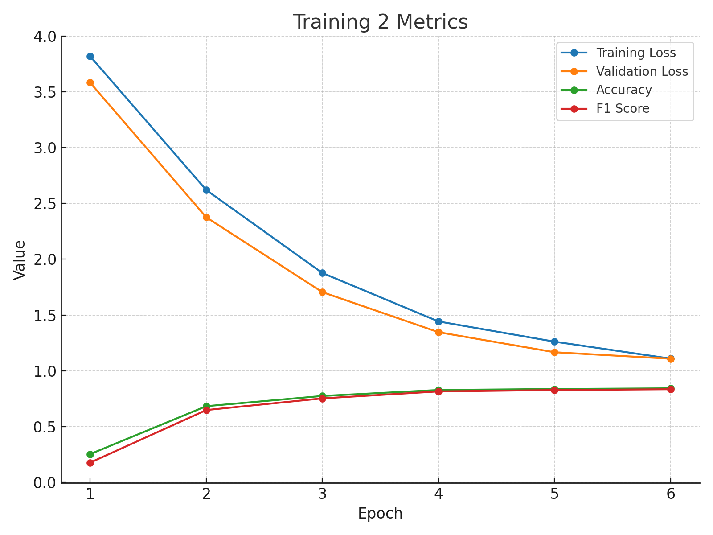

# Model Training Results (Day 2)

## What I Have Done
I fine-tuned a transformer-based model on the Banking77 dataset for intent classification. 
Two different training experiments were conducted with varying epochs and hyperparameters.

## Why I Did This
The purpose of this experiment was to evaluate how different training setups and epoch lengths 
affect model performance in terms of accuracy, F1 score, and loss. This helps in identifying the 
optimal configuration for achieving the best generalization without overfitting.

## What I Observed
- **Training 1**: With 3 epochs, the model showed steady improvement in both training and validation metrics. 
  Accuracy increased from ~63% to ~82%, and the F1 score improved from ~0.58 to ~0.81.
- **Training 2**: Extended training up to 6 epochs further improved performance. Accuracy reached ~84%, and the 
  F1 score reached ~0.83, suggesting that more epochs allowed the model to generalize better.

## Results

### Training 1
| Epoch | Training Loss | Validation Loss | Accuracy | F1 |
|-------|---------------|-----------------|----------|----|
| 1 | 2.686900 | 2.358365 | 0.634183 | 0.585885 |
| 2 | 1.611700 | 1.412736 | 0.804598 | 0.787639 |
| 3 | 1.223300 | 1.184362 | 0.828586 | 0.810834 |

## Training 1 Metrics

### Training 2
| Epoch | Training Loss | Validation Loss | Accuracy | F1 |
|-------|---------------|-----------------|----------|----|
| 1 | 3.818200 | 3.581690 | 0.254373 | 0.178236 |
| 2 | 2.620300 | 2.375874 | 0.683658 | 0.648898 |
| 3 | 1.877000 | 1.705462 | 0.775112 | 0.753473 |
| 4 | 1.442800 | 1.346659 | 0.828586 | 0.815657 |
| 5 | 1.261600 | 1.166769 | 0.837581 | 0.828035 |
| 6 | 1.109500 | 1.108825 | 0.843578 | 0.835301 |

## Training 2 Metrics

